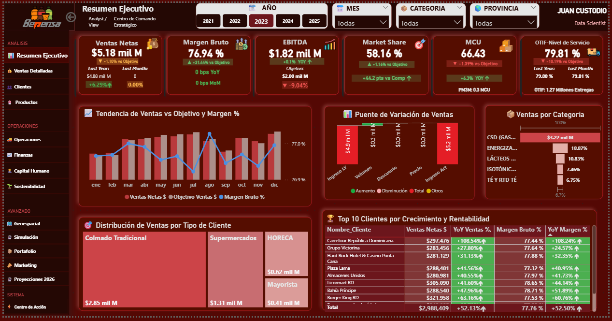

# 🥤 Bepensa Dominicana Commercial Intelligence
## Ecosistema de Simulación Analítica & Dashboard Prescriptivo





## 📋 Resumen Ejecutivo
**Problema:** ¿Cómo gestionar una operación FMCG masiva sin datos históricos estructurados y con alta incertidumbre de mercado?

**Solución:** Este proyecto es una solución integral "End-to-End" que combina **Ingeniería de Datos** (Simulación Monte Carlo) con **Inteligencia de Negocios** (Dashboard Prescriptivo). El sistema transforma terabytes de datos sintéticos en decisiones estratégicas de rentabilidad y eficiencia operativa.

> **Diferenciador:** El sistema no solo reporta el pasado, sino que **simula el futuro** (Proyecciones 2026) y **automatiza la acción** (Centro de Alertas).

---

## 🛠️ Arquitectura Técnica (The Stack)

### 🐍 Backend: Motor de Simulación (Python)
Diseñado para ser **"Out-of-Core"** (procesar datos mayores a la RAM disponible).
*   **Polars & DuckDB:** Pipeline ETL de alto rendimiento.
*   **NumPy:** Vectorización de cálculos financieros complejos (Impuestos detallados, Márgenes multicapa).
*   **Parquet:** Almacenamiento columnar con compresión ZSTD para optimizar la lectura en Power BI.

### 📊 Frontend: Experiencia de Usuario (Power BI)
*   **Star Schema:** Modelo dimensional puro (12 Hechos, 20 Dimensiones).
*   **Advanced DAX:** Uso de *Calculation Groups* para escenarios y *Disconnected Tables* para parámetros de simulación.

---

## 📦 Módulos del Sistema

| Módulo | Descripción | Impacto de Negocio |
| :--- | :--- | :--- |
| **1. Ingeniería** | Script `simulador.py` con lógica de elasticidad precio y caos operativo. | Generación de escenarios realistas (4 años) sin datos sensibles. |
| **2. Estrategia** | **Proyecciones 2026**: Escenarios Optimista/Pesimista. | Visibilidad de P&L futuro y probabilidad de metas (Monte Carlo). |
| **3. Operación** | **Centro de Acción**: Algoritmos de detección de "Churn Risk". | Priorización de tareas: "¿A quién llamo hoy para salvar la venta?". |
| **4. Gobierno** | **Control Técnico**: Monitor de Latencia y Calidad de Datos. | Garantía de fiabilidad (Data Trust) para el equipo directivo. |

---

## 🧠 Insights de Negocio (Ejemplos)
1.  **La "Trampa del Volumen":** El análisis revela que un crecimiento del **+1.5% en volumen** en la zona Sur generó una caída del **-0.5% en margen**, debido a una mezcla de productos (Sales Mix) inclinada hacia formatos de bajo retorno.
2.  **Eficiencia Logística:** El 80% de los quiebres de stock (OOS) ocurren en solo el 20% de las rutas, permitiendo intervenciones quirúrgicas en lugar de masivas.

---

## 🚀 Instalación y Uso

### Prerrequisitos
*   Python 3.9 o superior.
*   Power BI Desktop (Última versión).

### Pasos
1.  **Clonar el repositorio:**
    ```bash
    git clone [https://github.com/tu-usuario/bepensa-commercial-intelligence.git](https://github.com/tu-usuario/bepensa-commercial-intelligence.git)
    cd bepensa-commercial-intelligence
    ```

2.  **Generar la Data (Simulación):**
    ```bash
    pip install polars numpy pyarrow
    python src/simulador.py
    # Esto generará los archivos .parquet en la carpeta /data
    ```

3.  **Visualizar:**
    *   Abre `reports/Bepensa_Dashboard.pbix`.
    *   Actualiza la ruta de origen apuntando a tu carpeta `/data` local.

---

## 👤 Autor
Juan Miguel Custodio Morillo
*Data Scientist | Business Intelligence Specialist*

LinkedIn: www.linkedin.com/in/juan-miguel-custodio-morillo-46bb33196
Email: miguelcustodio162020@gmail.com
